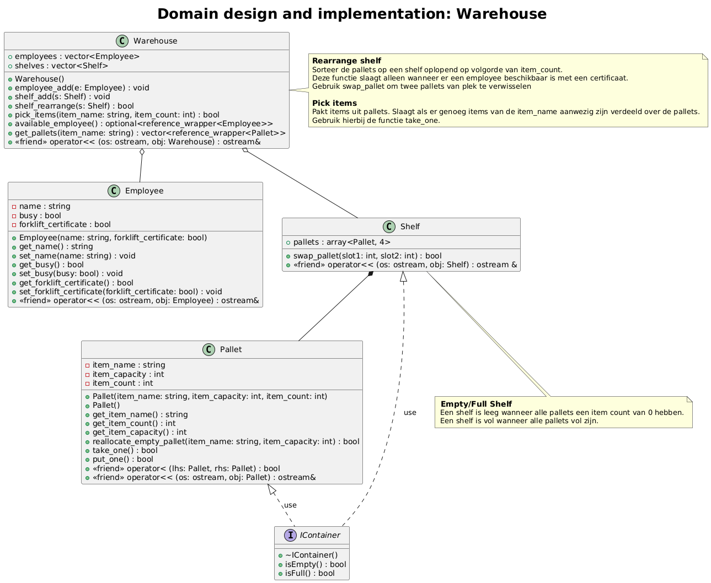

# PROG VII: Domain design and implementation

Student:

Studentnummer:

Link naar deze repository: 

Om te voorkomen dat te grote bestanden worden meegestuurd met een commit, staan de mappen .idea en cmake-build-debug in de .gitignore. Gelieve deze dus ook niet mee te proberen te pushen; dat is niet nodig.

De bijgeleverde code kan nog niet op zichzelf draaien. Gedurende de uitwerking van deze opdracht:

- moeten de lege bestanden worden ingevuld;
- moeten bestanden zoals de testsuite, waar al wel functies in staan, worden aangevuld;
- moeten er mogelijk bestanden worden toegevoegd;
- moet mogelijk de CMakeLists.txt-file worden aangepast, om te veranderen welke bestanden voor welke configuratie worden gecompileerd;

Dit doe je aan de hand van het volgende ontwerp 

zodat de code wel compleet functioneert conform de eisen op de Canvaspagina.

De CMakeLists.txt bevat twee configuraties:

- domain_design_and_implementation, die de main.cpp en alle bestanden in de src-map compileert;
- test_domain_design_and_implementation, die alle bestanden in de mappen src en test compileert.

Dit staat dus ook toe dat je je eigen main-functie in main.cpp en aanpalende bestanden zet, zonder dat dat de main-functie bijt die wordt gegenereerd door Catch.
